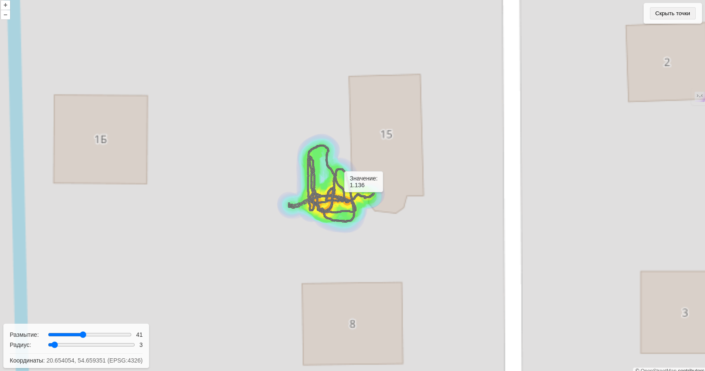
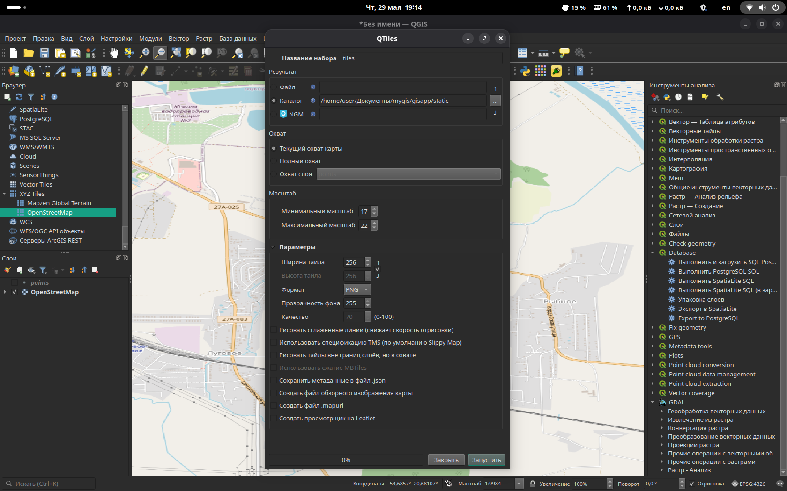

# Как работает решение:

## Серверная обработка:

1. Каждые 60 секунд (по умолчанию) сервер запускает импортер, который стартует сразу после запуска приложения.

2. Для работы импортера выделен отдельный поток, так что его работа не влияет на работу приложения.

3. Далее включается механизм уведомлений ([Server-Sent Events](https://learn.javascript.ru/server-sent-events)):

- Клиент устанавливает постоянное соединение с сервером через ендпоинт /data-updates/

- Сервер проверяет изменения количества объекто в базе каждую секунду

- При изменении количества объектов (в БД также идет проверка на уникальность данных) сервер отправляет уведомление

## Клиентская обработка:

1. При получении уведомления клиент асинхронно запрашивает свежие данные через ендпоинт /geojson-data/ и обновляет карту используя data signature.

2. Используется data signature (подпись данных)** для проверки реальных изменений. Данные на карте обновляются только при фактическом изменении (что позволяет уменьшить нагрузку на клиент при отрисовке карты).

3. Рассчитывается и визуализируется тепловая карта.

Эффективность:

- Нет постоянных запросов на сервер, клиент ждет уведомления для начал работы

- Отрисовка на карте только вновь добавленных данных. 

- Минимальная нагрузка на сервер и клиент

Особенности:

- При очистке базы подпись сбрасывается

- Автоматическое восстановление соединения при ошибках

- Корректное закрытие соединения при закрытии вкладки

**Это решение обеспечивает быстрое обновление карты при появлении новых данных в базе, без постоянного опроса сервера**.

**Используется подпись данных (data signature - это конкатенация строк, каждая из которых содержит координаты и значение точки) для того, чтобы определить, действительно ли данные изменились. Если подпись изменилась, значит, данные обновились, и нам нужно перерисовать карту.


# Настройки разработчика

python3 -m venv venv

source venv/bin/activate

pip3 install django

pip3 freeze > requirements.txt

django-admin startproject gisproject .

python3 manage.py startapp gisapp

Установка OpenLayers offline

переходим по ссылкам
<https://cdn.jsdelivr.net/npm/ol@latest/dist/ol.js>
<https://cdn.jsdelivr.net/npm/ol@latest/ol.css>

и сохраняем страницы в папки проекта, соответственно
/gisapp
   /js
      ol.js
   /css
      ol.css
   index.html

В index.html меняем ссылки на оффлайн версию
```html
<script src=""></script>
<link rel="stylesheet" href="">
```

Создаем тайловую оффлайн карту в QGIS (я использую расширение QTiles) и сохраняем в папку проекта tiles



В index.html меняем ссылки на оффлайн версию

// source: new ol.source.OSM( )
на
source: new ol.source.XYZ({
   url: 'gisapp/static/tiles/{z}/{x}/{y}.png'
})

# РАЗВОРАЧИВАЕМ ПРИЛОЖЕНИЕ ручками

Создаем виртуальную среду, активируем ее и устанавливаем все зависимости
---

python3 -m venv venv

source venv/bin/activate

python3 -m pip install -r requirements.txt

# УСТАНАВЛИВАЕМ И НАСТРАИВАЕМ PostgreSQL+PostGIS

## На MacOS

- Установить PostgreSQL

- Проверить стартанула ли служба postgresql

- Задаем переменную среды PATH (если нужен не стандартный путь к утилитам postgresql (например на MACOS))
Так нужно делать при каждом новом запуске терминала
PATH=$PATH:/Applications/Postgres.app/Contents/Versions/12/bin/

- Создаем БД с именем mygis
createdb -U postgres mygis

- Подключение к созданной БД
psql -U postgres -d mygis

- просмотр таблиц
\d

- выход
\q

- установка пароля зозданной БД
psql
ALTER USER postgres WITH PASSWORD 'mygispass';
Должны увидеть
ALTER ROLE
\q

- Устанавливаем расширение postgis
psql
CREATE EXTENSION postgis;
Должны увидеть CREATE EXTENSION
\q

## На Linux Manjaro

Переключаемся на пользователя
sudo su postgres

ALTER USER postgres WITH PASSWORD 'mygispass';

CREATE DATABASE mygis;

CREATE EXTENSION postgis;

\q
Переключаемся на юзера
exit

# ВНИМАНИЕ

### процедура загрузки данных из шейп-файла описана тут gisapp/load.py

# Установка приложения с помощью Docker-композа на Linux Manjaro

1. Установить Docker desktop от сюда <https://docs.docker.com/compose/install/>
2. Создать папку в любом месте и открыть в ней терминал
3. Клонировать проект с GitHub
`git clone <https://github.com/Inna949Festchuk/mygis.git>`

3. Перед запуском команды остановите службу postgresql, если она запущена (для Linux и MacOS)

```bash
sudo systemctl stop postgresql 
sudo systemctl disable postgresql
```

4.Перейти в папку проекта

```bash
cd mygis
```

5. Запустите команду

```bash
docker-compose up -d --build
```

6. Все можно открывать в браузере `http://localhost:8000/map`

Это упрощено:
<!-- 6. Зайти в контейнер с помощью команды

```bash
docker exec -it mygis-app-1 sh
```

7. Выполните команду

```bash
python manage.py migrate
```

8. После этого вызовите оболочку Django для загрузки данных из шейп-файла

```python
python manage.py shell
```

9. Далее импортируем модуль `load`, вызываем процедуру `run` и наблюдаем, как LayerMapping выполняет свою работу

```python
from gisapp import load
load.run()
```

10. Выходим из оболочки django shell

```python
exit()
```

11. Выходим из контейнера

```bash
exit
``` -->

# Запуск и остановка контейнеров с помощью бат-файла

Вот батники для запуска и остановки в которых те же команды. Но перед этим все равно нужно установить Docker-desktop, создать папку, поместить туда эти файлы, открыть терминал и там их запустить. На маке (zsh) `source start.sh`, остановить `source stop-server.sh`

### Запуск приложения. Инструкция по использованию

Вот bash-скрипт с учетом особенностей Manjaro Linux:

Особенности для Manjaro:

<!-- 1. Используется `xdg-open` для открытия браузера -->
2. Добавлена задержка для инициализации PostgreSQL
3. Добавлен `set -e` для прерывания при ошибках

Для использования (bash):

1. Сохраните скрипт как `start.sh`
2. Сделайте исполняемым: `chmod +x start.sh`
3. Запустите: `./start.sh`

Скрипт автоматически:

- Создаст директорию проекта
- Склонирует репозиторий
- Развернет Docker-окружение
- Запустит службу PostgreSQL
- Выполнит миграции
- Запустит приложение
<!-- - Загрузит данные из shape-файла (Разкоментировать в скрипте,если нужно загружать пространственные данные из шейпфайлов) -->
<!-- - Откроет приложение в браузере -->

### Остановка приложения. Инструкция по использованию

1. Сохраните скрипт как `stop-server.sh`
2. Сделайте исполняемым:

```bash
chmod +x stop-server.sh
```

3. Запустите:

```bash
./stop-server.sh
```

### Особенности

1. Автоматически определяет расположение скрипта
2. Проверяет наличие директории проекта
3. Удаляет все связанные ресурсы (контейнеры, сети)
4. Совместим с Manjaro/Arch Linux
5. Выводит статус выполнения операций

Для полной очистки с удалением volumes добавьте флаг `-v`: (на будущее)

```bash
docker-compose down -v
```

# DEPLOY

Чтобы установить Docker Compose на Ubuntu, выполните следующие шаги:

### 1. Установите Docker Engine (если ещё не установлен)

Перед установкой Docker Compose убедитесь, что Docker Engine установлен.

#### Обновите пакеты и установите зависимости

```bash
sudo apt update
sudo apt install -y ca-certificates curl gnupg
```

#### Добавьте официальный GPG-ключ Docker

```bash
sudo install -m 0755 -d /etc/apt/keyrings
curl -fsSL https://download.docker.com/linux/ubuntu/gpg | sudo gpg --dearmor -o /etc/apt/keyrings/docker.gpg
sudo chmod a+r /etc/apt/keyrings/docker.gpg
```

#### Добавьте репозиторий Docker

```bash
echo \
  "deb [arch=$(dpkg --print-architecture) signed-by=/etc/apt/keyrings/docker.gpg] https://download.docker.com/linux/ubuntu \
  $(. /etc/os-release && echo "$VERSION_CODENAME") stable" | \
  sudo tee /etc/apt/sources.list.d/docker.list > /dev/null
```

#### Установите Docker

```bash
sudo apt update
sudo apt install -y docker-ce docker-ce-cli containerd.io
```

#### Проверьте установку Docker

```bash
sudo docker run hello-world
```

### 2. Установите Docker Compose

#### Скачайте бинарный файл Docker Compose

Замените `v2.24.5` на [актуальную версию](https://github.com/docker/compose/releases):

```bash
sudo curl -L "https://github.com/docker/compose/releases/download/v2.24.5/docker-compose-linux-$(uname -m)" -o /usr/local/bin/docker-compose
```

#### Дайте права на выполнение

```bash
sudo chmod +x /usr/local/bin/docker-compose
```

#### Проверьте установку

```bash
docker-compose --version
```

Вывод должен быть похож на:  
`Docker Compose version v2.24.5`

---

### Альтернативный вариант: Docker Compose как плагин (рекомендуется)

Если вы установили Docker через официальный репозиторий, можно добавить плагин `docker-compose-plugin`:

```bash
sudo apt install -y docker-compose-plugin
```

Проверьте работу:

```bash
docker compose version
```

Команда использует пробел вместо дефиса: `docker compose`.

---

### Примечания

- Для работы без `sudo` добавьте пользователя в группу `docker`:  

  ```bash
  sudo usermod -aG docker $USER
  newgrp docker  # Обновите сессию
  ```

- Актуальные версии Docker Compose смотрите на [GitHub](https://github.com/docker/compose/releases).
