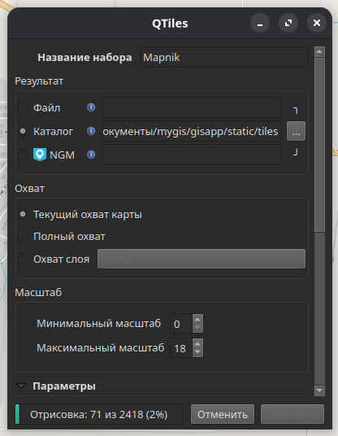

# Настройки разработчика

python3 -m venv venv

source venv/bin/activate

pip3 install django

pip3 freeze > requirements.txt

django-admin startproject gisproject .

python3 manage.py startapp gisapp

Установка OpenLayers offline

переходим по ссылкам
<https://cdn.jsdelivr.net/npm/ol@latest/dist/ol.js>
<https://cdn.jsdelivr.net/npm/ol@latest/ol.css>

и сохраняем страницы в папки проекта, соответственно
/gisapp
   /js
      ol.js
   /css
      ol.css
   index.html

В index.html меняем ссылки на оффлайн версию

<script src=""></script>
<link rel="stylesheet" href="">

Создаем тайловую оффлайн карту в QGIS (я использую расширение QTiles) и сохраняем в папку проекта tiles



В index.html меняем ссылки на оффлайн версию

// source: new ol.source.OSM( )
на
source: new ol.source.XYZ({
   url: 'gisapp/static/tiles/{z}/{x}/{y}.png'
})

# РАЗВОРАЧИВАЕМ ПРИЛОЖЕНИЕ ручками

Создаем виртуальную среду, активируем ее и устанавливаем все зависимости
---

python3 -m venv venv

source venv/bin/activate

python3 -m pip install -r requirements.txt

# УСТАНАВЛИВАЕМ И НАСТРАИВАЕМ PostgreSQL+PostGIS

## На MacOS

- Установить PostgreSQL

- Проверить стартанула ли служба postgresql

- Задаем переменную среды PATH (если нужен не стандартный путь к утилитам postgresql (например на MACOS))
Так нужно делать при каждом новом запуске терминала
PATH=$PATH:/Applications/Postgres.app/Contents/Versions/12/bin/

- Создаем БД с именем mygis
createdb -U postgres mygis

- Подключение к созданной БД
psql -U postgres -d mygis

- просмотр таблиц
\d

- выход
\q

- установка пароля зозданной БД
psql
ALTER USER postgres WITH PASSWORD 'mygispass';
Должны увидеть
ALTER ROLE
\q

- Устанавливаем расширение postgis
psql
CREATE EXTENSION postgis;
Должны увидеть CREATE EXTENSION
\q

## На Linux Manjaro

Переключаемся на пользователя
sudo su postgres

ALTER USER postgres WITH PASSWORD 'mygispass';

CREATE DATABASE mygis;

CREATE EXTENSION postgis;

\q
Переключаемся на юзера
exit

# ВНИМАНИЕ

### процедура загрузки данных из шейп-файла описана тут gisapp/load.py

# Установка приложения с помощью Docker-композа на Linux Manjaro

1. Установить Docker desktop от сюда <https://docs.docker.com/compose/install/>
2. Создать папку в любом месте и открыть в ней терминал
3. Клонировать проект с GitHub
git clone <https://github.com/Inna949Festchuk/mygis.git>

3. Перед запуском команды остановите службу postgresql, если она запущена (для Linux и MacOS)

```bash
sudo systemctl stop postgresql 
sudo systemctl disable postgresql
```

4.Перейти в папку проекта

```bash
cd mygis
```

5. Запустите команду

```bash
docker-compose up -d --build
```

6. Зайти в контейнер с помощью команды

```bash
docker exec -it mygis-app-1 sh
```

7. Выполните команду

```bash
python manage.py migrate
```

8. После этого вызовите оболочку Django для загрузки данных из шейп-файла

```python
python manage.py shell
```

9. Далее импортируем модуль `load`, вызываем процедуру `run` и наблюдаем, как LayerMapping выполняет свою работу

```python
from gisapp import load
load.run()
```

10. Выходим из оболочки djangoshell

```python
exit()
```

11. Выходим из контейнера

```bash
exit
```

7. Открываем приложение в браузере

```bash
xdg-open "http://localhost:8000/map"
```

# Запуск и остановка контейнеров с помощью бат-файла

Вот батники для запуска и остановки в которых те же команды. Но перед этим все равно нужно установить Docker-desktop, создать папку, поместить туда эти файлы, открыть терминал и там их запустить. На маке (zsh) `source start.sh`, остановить `source stop-server.sh`

### Запуск приложения. Инструкция по использованию

Вот bash-скрипт с учетом особенностей Manjaro Linux:

Особенности для Manjaro:

1. Используется `xdg-open` для открытия браузера
2. Добавлена задержка для инициализации PostgreSQL
3. Автоматизирован ввод команд в Django shell
4. Упрощена логика работы с путями
5. Добавлен `set -e` для прерывания при ошибках

Для использования (bash):

1. Сохраните скрипт как `start.sh`
2. Сделайте исполняемым: `chmod +x start.sh`
3. Запустите: `./start.sh`

Скрипт автоматически:

- Создаст директорию проекта
- Склонирует репозиторий
- Развернет Docker-окружение
- Выполнит миграции
- Загрузит данные из shape-файла
- Откроет приложение в браузере

### Остановка приложения. Инструкция по использованию

1. Сохраните скрипт как `stop-server.sh`
2. Сделайте исполняемым:

```bash
chmod +x stop-server.sh
```

3. Запустите:

```bash
./stop-server.sh
```

### Особенности

1. Автоматически определяет расположение скрипта
2. Проверяет наличие директории проекта
3. Удаляет все связанные ресурсы (контейнеры, сети)
4. Совместим с Manjaro/Arch Linux
5. Выводит статус выполнения операций

Для полной очистки с удалением volumes добавьте флаг `-v`: (на будущее)

```bash
docker-compose down -v
```
